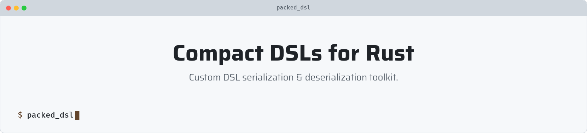

# packed_dsl

This project is in its planning stage and the information you can see below is
speculative, but it shows my thoughts  about the design and goals of `packed_dsl`.

<picture>
   <source media="(prefers-color-scheme: dark)" srcset="art/header-dark.png">
   
</picture>

## About

This crate is made with a purpose to facilitate the creation of extremely compact and efficient mods / plugins / network protocols 
through custom bytecode DSLs, generated from Rust enums.

The crate's goals are:
- minimizing disk and memory usage
- reducing runtime overhead
- providing deterministic and portable deserialization
- depending only on `core`, allowing use in `no_std`, embedded, and allocator-free environments

In contrast to Lua and Wasm, `packed_dsl` is not intended for creating another general-purpose scripting language:
it is intended for creating bytecode from high-level instructions defined by the programmer, that, once deserialized,
are executed directly by Rust code, therefore minimizing runtime overhead even more.

The library handles:
- DSL serialization & deserialization with a compact bytecode generation
- automatic discriminant sizing
- padding removal on serialization
- compatibility check through compile-time hashes

The user remains responsible for handling the deserialized instructions. During compilation, 
the crate computes hashes of all types used in the instruction set, then the instruction set itself.
The hash result is embedded into the binary, and a mod / plugin / network protocol can simply use
the public associated constant of the instruction enum to embed the hash into the DSL contents too.
At runtime, there's a negligible overhead: u64 == u64 (may be changed to u128).